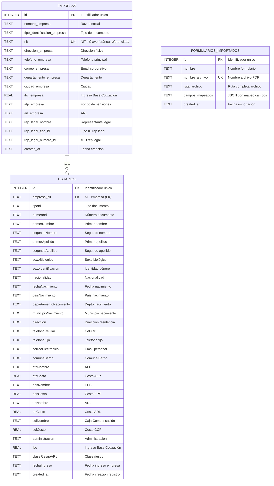
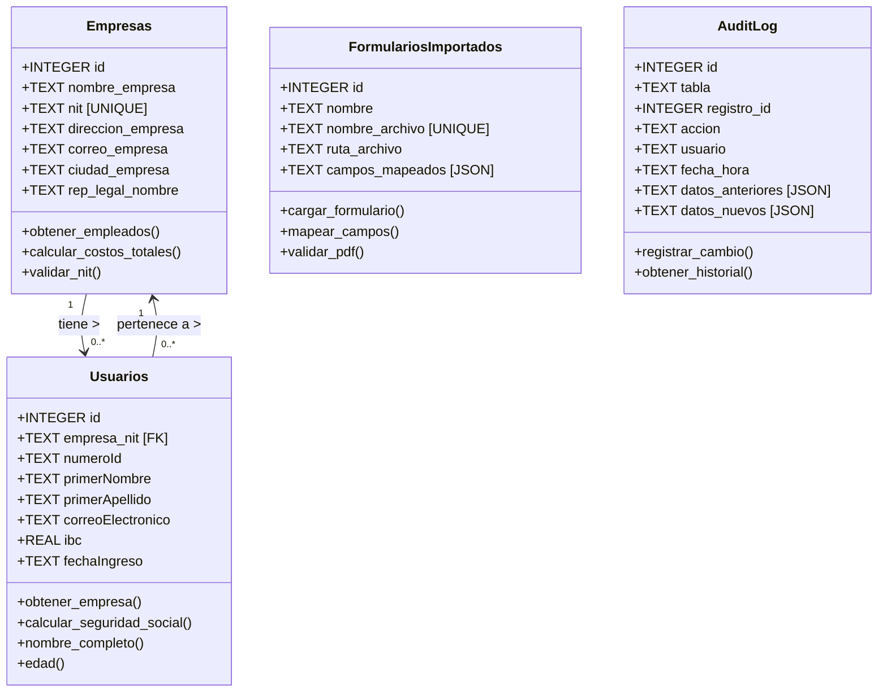
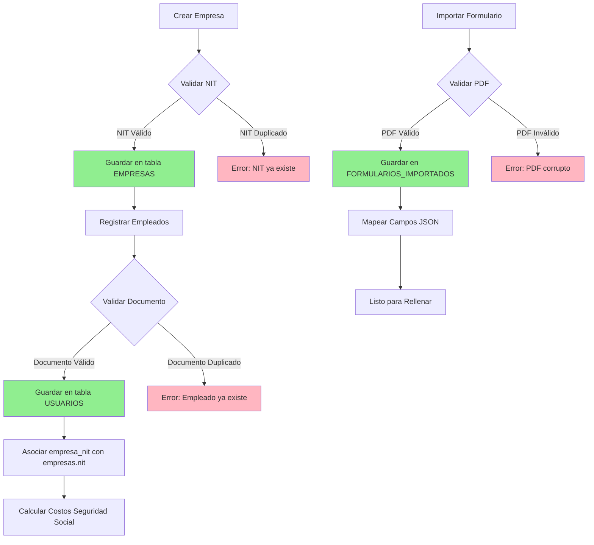
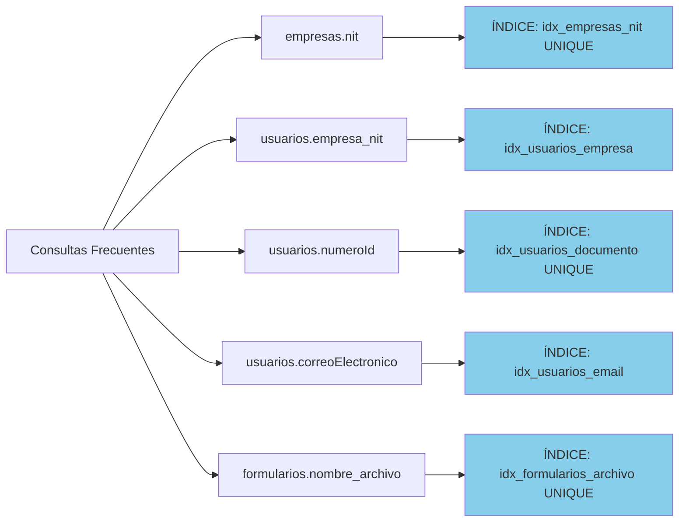
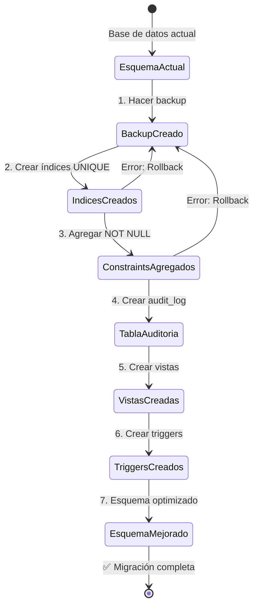
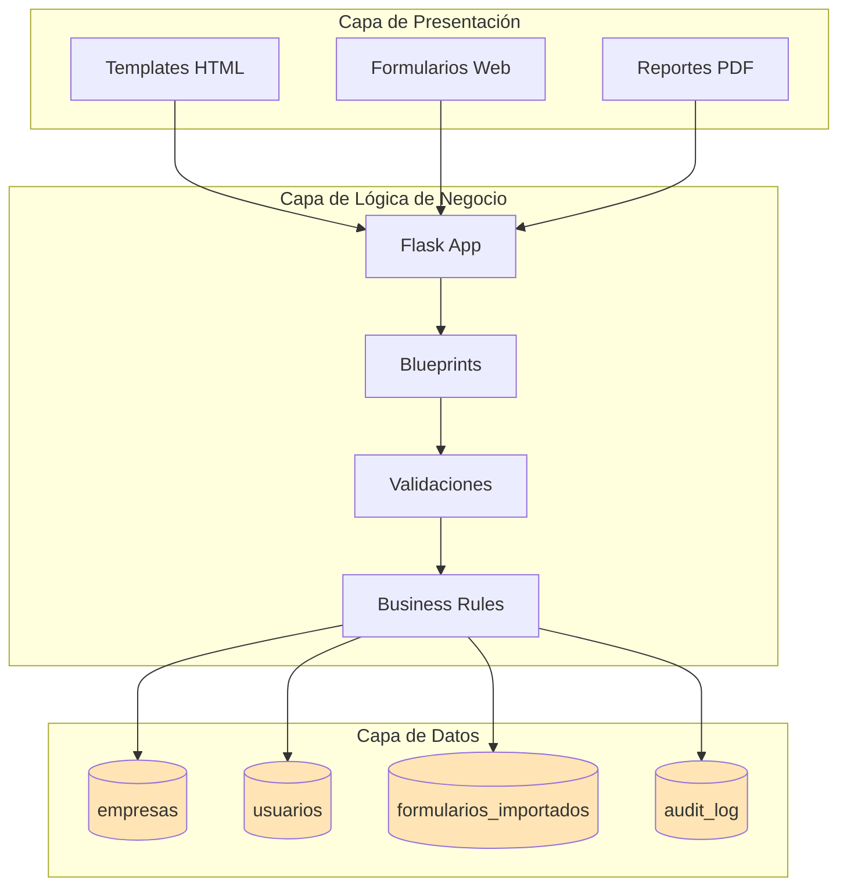
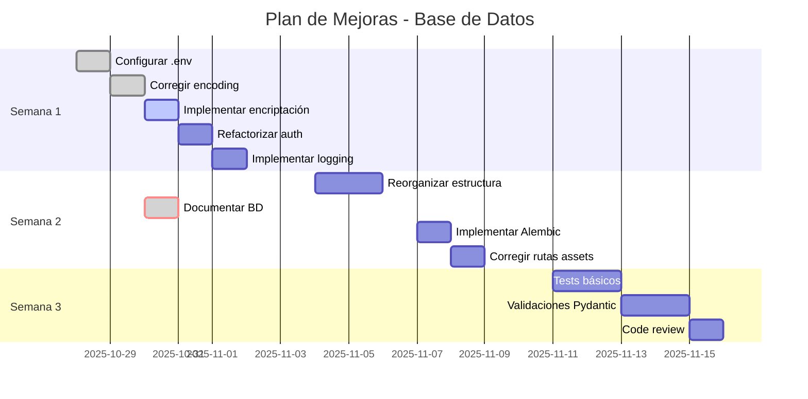

# Diagrama de Base de Datos - Sistema Montero

## Diagrama ER (Entity Relationship)

## Diagrama de Clases (Estructura de Datos)

## Flujo de Datos

## Índices y Performance

## Estados de Migración (Recomendado)

## Arquitectura de 3 Capas

## Timeline de Mejoras (Plan de Acción)

---

## Notas de Implementación

### Prioridad Alta 🔴
- Agregar UNIQUE constraint en `empresas.nit`
- Agregar UNIQUE constraint en `usuarios(tipoId, numeroId)`
- Hacer NOT NULL campos críticos

### Prioridad Media 🟠
- Crear índices en campos de búsqueda frecuente
- Implementar tabla audit_log
- Crear vistas útiles

### Prioridad Baja 🟡
- Normalizar datos de seguridad social
- Migrar fechas de TEXT a INTEGER
- Implementar triggers de auditoría

---

*Diagramas generados para documentación de base de datos - 30 octubre 2025*
